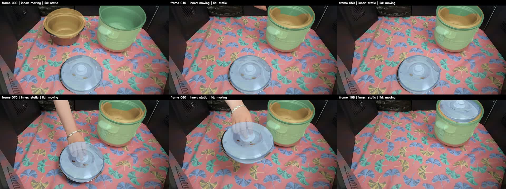
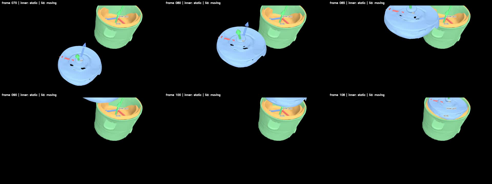

# 三部件 6D Pose：当前瓶颈、解决路线与数据协作需求

> **2026-07-14 v4 更新：** depth gauge 审计、body 六视角 yaw 修正和 lid
> 六视角 full-silhouette + RGB-edge SE(3) refinement 已完成。lid 的可观测
> X/Z tilt 已进入轨迹，本序列中的 local-Y yaw 仍被灵敏度测试判为弱可观测，
> 因此继续锁定。当前候选结果和六视角 A/B 见
> `experiments/three_part_multiview_111f/LID_SE3_V4_REPORT.md`。本文后续所述
> “lid 整个 SO(3) 被锁定”仅描述原始 `outputs` baseline；当前尚未完成的最高
> 优先级已收敛为人工 GT、语义轴与装配定义。

> 更新日期：2026-07-14  
> 数据范围：六视角、111 帧（`000000`–`000110`）  
> 部件：`body`、`inner_pot`、`lid`  
> 当前主结果：`experiments/three_part_multiview_111f`

## 1. 文档目的

当前系统已经能够输出三个部件逐帧统一的 world/body-relative Pose，并生成 RGB
overlay、纯 mesh 视频和带 XYZ 坐标轴的视频。但“能够稳定渲染”不等于“已经得到
可定量证明准确的完整 6D Pose”。本文档用于回答四个问题：

1. 当前系统已经做到了什么，尚未做到什么；
2. 限制精度和复用性的主要瓶颈是什么；
3. 哪些问题需要数据公司提供额外数据或标注，哪些可以直接由算法解决；
4. 下一阶段应按什么顺序推进，以及每一阶段如何验收。

## 2. 当前系统与结果

### 2.1 输入

- 六视角同步 RGB：`2-1`–`2-6`；
- 六视角 palette mask：lid=1、body=2、inner_pot=3；
- DA3 self-cond 的 depth、confidence、相机内参和外参；
- 三个带 UV/PBR 纹理的 GLB mesh；
- 已验证的前 45 帧 body/inner_pot 轨迹。

### 2.2 当前求解方式

| 部件 | 当前方式 | 动态旋转是否逐帧测量 |
|---|---|---|
| body | 使用稳定标定，0–110 帧固定 | 不需要，假设静止 |
| inner_pot | 复用前 45 帧验证轨迹，插入后保持最终 Pose | 来自已有轨迹，不是本轮六视角重求 |
| lid | DA3 点云给尺度和首尾锚点；六视角 mask 包络求动态平移 | 否，整个 SO(3) 使用起始旋转并锁定 |

所有 part 最终输出：

- `T_world_from_part`：part 到 DA3 world 的刚体变换；
- `T_body_from_part = inv(T_world_from_body) @ T_world_from_part`；
- `S_world_from_raw_mesh`：包含固定 mesh scale 的渲染变换；
- body-relative translation 和 `xyzw` quaternion；
- 状态、可见视角数和相邻帧运动量。

### 2.3 实际渲染结果

下图依次展示第 0、40、50、70、80、108 帧。绿色为 body，橙色为
inner_pot，蓝色为 lid。第 40 帧 inner_pot 已进入 body；第 70–80 帧 lid
由桌面平移并抬起；第 108 帧 lid 到达装配位置。



下图是 lid 运动阶段的纯 mesh + 坐标轴结果，依次为第 70、80、85、90、100、
108 帧。X 红、Y 绿、Z 蓝。第 90 帧 lid 在主视角中大部分离开画面，说明单一
主视角指标不能完整评价六视角 Pose。



完整结果：

- `experiments/three_part_multiview_111f/outputs/pose/trajectory.json`
- `experiments/three_part_multiview_111f/outputs/render/2-3/overlay.mp4`
- `experiments/three_part_multiview_111f/outputs/render/2-3/mesh_only.mp4`
- `experiments/three_part_multiview_111f/outputs/render/2-3/mesh_axes.mp4`

三个视频均为 1280×720、30 FPS、111 帧。当前 view `2-3` 可见轮廓平均 IoU：

| 部件 | 可见帧平均 IoU | 说明 |
|---|---:|---|
| body | 0.620 | 全程静止，但 mesh/mask/标定仍存在投影差异 |
| inner_pot | 0.603 | 部分帧离开主视角或被 body 遮挡 |
| lid | 0.866 | 静止帧占比较大 |
| lid 运动阶段 | 0.802 | 遮挡、截断和旋转锁定使难度更高 |

IoU 只是二维投影指标，不能回答三维平移误差是 5 mm 还是 30 mm，也不能可靠
评价轴对称物体的旋转。

## 3. 当前物体状态有多少种

### 3.1 代码实际输出：3 种状态

当前 `trajectory.json` 中只有三种正式状态：

1. `static`：不在人工配置的动态区间，Pose 使用固定锚点或边界 Pose；
2. `moving`：位于人工配置的动态区间，且至少一个视角存在 mask；
3. `inferred_unobservable`：六个视角都没有该 part 的 mask，Pose 来自插值或先验。

决策逻辑是：

```text
body
└── 始终 static

其它 part
├── 六视角 mask 全为空 -> inferred_unobservable
├── 至少一个视角可见，且在 dynamic_ranges -> moving
└── 其它情况 -> static
```

当前逐 part 状态统计：

| 部件 | 状态 | 帧范围 | 帧数 |
|---|---|---:|---:|
| body | static | 0–110 | 111 |
| inner_pot | moving | 0–22、25–40 | 39 |
| inner_pot | inferred_unobservable | 23–24 | 2 |
| inner_pot | static | 41–110 | 70 |
| lid | static | 0–49、109–110 | 52 |
| lid | moving | 50–108 | 59 |

配置区间边界存在重叠时，`moving` 优先。例如 lid 第 108 帧既是动态终点也是静态
锚点，但最终记录为 `moving`；第 109–110 帧记录为 `static`。

### 3.2 当前没有正式实现的状态

#### `occluded`

只要任意一个视角还存在少量 mask，当前仍会标记为 `moving` 或 `static`。以下情况
不会成为独立状态：

- 手遮挡大部分物体；
- mask 只剩局部；
- mask 存在，但 mask 内 depth 属于手；
- 物体接触图像边界；
- 只剩一个低质量视角；
- 六视角残差相互矛盾。

lid 跟踪器内部会记录 `measured` 或 `motion_prior`，但这只是诊断信息，尚未进入主
状态机。

#### `assembled`

当前没有几何接触或装配事件检测。inner_pot 第 40 帧后、lid 第 108 帧后保持固定
Pose，隐式表达“已经装配”，但正式状态仍然是 `static`。

### 3.3 建议的目标状态机：5 种状态

下一版建议正式定义：

1. `UNOBSERVED`：有效视角不足，Pose 主要依赖先验；
2. `STATIC_FREE`：可见且静止，但尚未装配；
3. `MOVING`：平移或旋转速度持续超过阈值；
4. `CONTACTING`：接近装配位置，可能发生接触但尚未稳定；
5. `ASSEMBLED`：相对 body Pose、接触距离和持续时间同时满足装配条件。

状态切换必须加入持续帧数和滞回，避免在阈值附近反复跳变。对当前固定序列，人工
区间已经较可靠；自动 FSM 的主要价值是后续复用和规模化，而不是当前最高优先级的
精度提升。

## 4. 当前核心瓶颈

### 4.1 DA3 世界系和 depth 时序质量尚未量化

已有检查显示：

- 六个相机外参跨 111 帧保持固定；
- 外参平移漂移为 0，旋转数值变化约 0.04°；
- 静止 body 的融合点云质心跨帧散布中位数约 18 mm、最大约 28 mm。

点云质心变化同时包含可见面变化和 depth 抖动，不能直接视为纯深度误差，但它已经
说明当前点云的有效稳定性可能只有厘米级。现有参数却包括：

- 8 mm fitness 阈值；
- 3/6/12 mm voxel；
- 22–90 mm correspondence range。

如果 depth 本身有 10–20 mm 级时序噪声，那么继续细调 3 mm voxel 不会得到 3 mm
Pose 精度。

还需要区分：

1. 局部像素随机噪声；
2. 整帧 depth scale/offset 漂移；
3. mask 和可见面变化；
4. 六相机之间固定但有偏差的外参。

相机外参“跨时间稳定”不等于“跨相机绝对准确”。固定的外参误差仍会让六视角点云
和投影无法正确重合。

### 4.2 缺少 3D Pose ground truth

目前唯一连续定量指标是单视角 silhouette IoU，加上人工观察 overlay。系统无法回答：

- 当前 translation error 是多少毫米；
- roll/pitch/yaw error 是多少度；
- 改动后是提升还是只让视频更平滑；
- depth、相机、mesh、状态先验分别贡献了多少误差。

没有参考 Pose 时，depth residual、RGB feature、temporal prior、assembly constraint 的
权重只能靠视觉盲调。

### 4.3 lid 运动阶段的整个 SO(3) 被锁定

当前不是只锁定轴对称 yaw，而是：

```text
R_lid(frame) = R_lid(start_anchor), frame=50..108
```

所以 lid 动态输出中：

- translation 是六视角轮廓和时序先验的估计；
- roll 是假设；
- pitch 是假设；
- yaw 是假设。

人在拿盖子时出现倾斜是常见现象，roll/pitch 在完整轮廓中本来有可能被观察到。当前
方法只比较 `xmin/ymin/xmax/ymax` 四条包络边，丢失了：

- 把手和按钮方向；
- 非对称轮廓；
- 孔洞投影；
- 内部结构；
- 原始 RGB 纹理。

三个 GLB 都有 UV 和 1024×1024 PBR base-color texture，因此具备做纹理/特征渲染
优化的基础。

### 4.4 遮挡条件下 mask 正确不代表 depth 正确

手遮住 lid 时，可能出现：

```text
语义标签属于 lid，但该像素的预测 depth 来自手或遮挡边界。
```

直接对 mask 内点云做 ICP 会把 Pose 拉向手。当前 silhouette-envelope 方法减轻了这个
问题，但当 lid 离开多个相机或接触图像边界时，可用约束仍会显著下降。

### 4.5 body/inner/lid 尚未进行真正的六视角全时序联合优化

当前是分部件、分阶段求解：

- body 使用稳定 prior；
- inner_pot 使用已有单视角验证轨迹；
- lid 使用六视角 mask；
- DA3 点云主要提供尺度和锚点。

系统已经导出统一 body-relative Pose，但还不是一个同时优化三部件、六视角、111 帧
和装配约束的全局问题。

### 4.6 状态依赖人工区间

当前序列已通过人工检查修正了 lid 起始运动帧，因此这不是当前最大精度瓶颈。但对新
序列，如果动态区间设置错误，静态锁定或错误运动先验会直接造成 Pose 偏差。

### 4.7 mesh 语义坐标和几何精度尚未标定

当前坐标轴原点是 GLB 几何质心，方向是 GLB 原始局部轴。它不一定对应业务语义中的：

- lid 把手朝向；
- inner_pot 正前方；
- body 正前方；
- 装配轴和接触平面。

如果要定量评价旋转和装配，需要先定义每个 part 的语义坐标系，并确认 mesh 尺寸、
形状和真实物体一致。

## 5. 数据公司与算法侧职责划分

### 5.1 总表

| 问题 | 数据公司可提供 | 算法可直接解决 | 主要责任 |
|---|---|---|---|
| depth 时序噪声 | 原始深度/标定数据、尺度参照物、静态标定序列 | 固定 patch 审计、scale/offset 检测、时序滤波、动态降权 | 双方 |
| 相机绝对精度 | 标定板序列、畸变参数、重新标定结果 | 极线/重投影审计、bundle adjustment、异常视角降权 | 双方 |
| 3D Pose GT | 关键帧 Pose、关键点、物理尺寸、复核标注 | 标注工具、六视角同步预览、误差指标和自动 QA | 数据公司主导、算法提供工具 |
| lid 旋转 | 把手/按钮关键点、语义轴、无遮挡参考帧 | full silhouette、RGB feature、纹理渲染、SE(3) 优化 | 双方 |
| 手部遮挡 | hand/occluder mask、visible/amodal mask、可见率 | 鲁棒损失、视角权重、截断边处理、时序先验 | 双方 |
| 自动状态 | 每帧状态或关键事件标签 | FSM、滞回、速度/接触/残差判定 | 算法为主 |
| 装配判断 | 标准装配 Pose、允许公差、接触定义 | mesh 距离、相对 Pose、持续时间约束 | 双方 |
| 三部件联合优化 | 通常无需新数据 | factor graph、联合残差、时序/接触约束 | 算法 |
| 原始纹理渲染 | 正确纹理或 CAD/PBR 资产 | 材质渲染、feature atlas、光照鲁棒损失 | 算法为主 |

### 5.2 建议数据公司交付内容

#### A. 8–10 个关键帧的多视角参考 Pose

建议首批帧：

```text
0, 8, 12, 20, 40, 50, 70, 80, 85, 100, 108
```

可先从中选 8–10 帧。每个关键帧应提供：

- 三个 part 的统一 4×4 Pose，而不是六个互相独立的单视角 Pose；
- 使用的 world/body 坐标约定；
- 标注者置信度；
- 哪些自由度不可观测；
- 六视角 overlay 截图；
- 至少两人复核或一次集中复核。

如果数据公司无法直接标 3D Pose，可以提供六视角 2D 关键点和高质量 mask，由算法
通过相机 K/E 统一拟合 3D Pose。

#### B. 语义关键点和坐标轴

建议至少标注：

- lid：把手中心、把手方向两端、按钮/孔洞、圆环中心；
- inner_pot：圆环中心、可识别把手或缺口、上沿关键点；
- body：正面中心、把手/控制面板方向、锅口圆心。

需要明确每个 part 的语义 X/Y/Z 方向。否则 axis-symmetric yaw 没有统一的评价标准。

#### C. 遮挡信息

建议每个视角、每帧增加：

- `visible_fraction`；
- `truncated`：是否接触图像边界；
- `occluder_type`：hand/body/other/out-of-frame；
- hand mask；
- visible mask；
- 条件允许时提供 amodal mask。

amodal mask 对 lid 被手遮挡时恢复完整轮廓尤其有价值。

#### D. 标准装配定义

需要数据公司或业务方确认：

- `T_body_from_inner_assembled`；
- `T_body_from_lid_assembled`；
- translation 容差；
- rotation 容差；
- 哪些 yaw 属于对称等价；
- 接触面和允许穿透量。

#### E. 相机和物理尺度

如果允许补采，建议提供：

- 六相机标定板序列；
- 完整畸变参数；
- 场景内已知尺寸标尺；
- 每个 mesh 对应真实物体的关键尺寸；
- 静态场景连续拍摄序列，用于 depth temporal audit。

### 5.3 算法侧可以立即完成的工作

以下工作不依赖新增数据即可开始：

1. 固定静态 patch 的 depth temporal noise 审计；
2. 六相机极线和重投影一致性审计；
3. 将所有阈值从经验值改为由实测噪声驱动；
4. 建立多视角人工 Pose 调整工具；
5. 建立 translation/rotation/ADD-S/reprojection 指标；
6. lid 从 bbox 升级为 full silhouette distance transform；
7. 恢复 GLB 原始纹理并提取多视角 RGB feature；
8. 对 lid 做 yaw/pitch/roll 可观测性扫描；
9. 只在高可见关键帧优化完整 SE(3)；
10. 加入角速度、角加速度和遮挡鲁棒时序约束；
11. 实现 FSM 和装配几何判定；
12. 最后实现三部件六视角全时序联合优化。

## 6. 建议解决路线

### 阶段 0：冻结当前 baseline

保留当前配置、Pose、视频和指标，后续所有实验必须与同一 baseline 对比，不允许只凭
单个视频主观判断。

交付物：

- 当前 111 帧轨迹；
- 三个结果视频；
- 每帧 silhouette 指标；
- 当前配置和随机种子；
- 本文档中的状态统计。

### 阶段 1：建立测量体系（最高优先级）

#### 1A. DA3 depth audit

对每个相机选择多个长期静态 patch，统计：

- 每像素 temporal median/MAD；
- patch 中位 depth 的 temporal MAD；
- 点到参考平面的法向误差；
- confidence 与 error 相关性；
- 是否存在 frame-wise scale/offset；
- 六视角同一静态表面的融合残差。

#### 1B. Camera audit

- 静态 RGB 特征匹配；
- 极线误差；
- 三角化后六视角重投影误差；
- 固定外参是否存在系统偏差。

#### 1C. 关键帧参考 Pose

建立 8–10 帧人工多视角参考 Pose，并记录标注不确定度。

阶段门槛：能够回答当前每个 part 的 translation/rotation error，而不只是 IoU。

### 阶段 2：lid 旋转可观测化

先进行 loss sensitivity 测试：围绕当前 Pose 分别扰动 yaw/pitch/roll，检查：

- full silhouette loss；
- edge distance；
- RGB feature loss；
- 关键点 reprojection loss。

只有对扰动敏感的自由度才开放优化。建议目标：

```text
silhouette + RGB feature + keypoint + weak depth + temporal prior
```

先在关键帧做完整 SE(3)，经 GT 证明有效后再扩展到 111 帧。

阶段门槛：关键帧 rotation error 明显下降，translation 不退化，遮挡帧不出现旋转跳变。

### 阶段 3：完整 lid 时序 refinement

- 六视角共享同一个三维 Pose；
- 每个视角根据可见率、截断、feature 内点率和 depth residual 动态加权；
- 加入 translation/angular velocity 和 acceleration；
- 对不可观测 yaw 使用对称等价或较强先验；
- 对严重遮挡帧输出置信区间，而不是伪装成同等可靠的测量值。

### 阶段 4：自动状态 FSM

状态证据包括：

- 有效视角数；
- visible fraction；
- feature/silhouette/depth residual；
- translation/angular velocity；
- 到标准装配 Pose 的距离；
- mesh 接触距离；
- 状态持续帧数。

先离线运行并与人工区间比较，达到稳定后再替代配置中的人工 ranges。

### 阶段 5：三部件联合优化

最终统一优化：

\[
\begin{aligned}
E =
&\lambda_s E_{silhouette}
+\lambda_f E_{feature}
+\lambda_d E_{depth}\\
&+\lambda_t E_{temporal}
+\lambda_c E_{contact}
+\lambda_a E_{assembly}
\end{aligned}
\]

约束包括：

- body 为固定参考；
- inner_pot/body 插入与同轴约束；
- lid/body 接触与装配约束；
- 六视角共享 Pose；
- 遮挡视角鲁棒降权；
- 对称旋转等价；
- 全时序连续性。

该阶段工程量最大，必须在 depth/camera audit 和 GT 建立之后进行，否则各损失权重无法
可靠确定。

## 7. 建议评价指标

### 7.1 Pose 指标

- translation error，单位 mm；
- rotation geodesic error，单位 degree；
- ADD；
- 对称物体 ADD-S；
- body-relative assembly translation/rotation error。

### 7.2 投影指标

- 六视角 silhouette IoU，而不是只看 `2-3`；
- full contour Chamfer/distance-transform error；
- 语义关键点 reprojection error；
- RGB feature alignment error。

### 7.3 稳定性指标

- 静止区间 translation jitter；
- 静止区间 rotation jitter；
- moving 区间速度和加速度异常值；
- 遮挡前后 Pose continuity；
- assembled 状态持续性。

### 7.4 置信度

每帧应输出：

- 有效视角数；
- 每视角 residual；
- 可见率和截断标记；
- Pose covariance 或近似置信度；
- measured/prior/interpolated 的来源比例。

## 8. 优先级结论

针对“准确的三个 part 6D Pose”，建议顺序为：

1. **量化 DA3 depth 与六相机绝对质量；**
2. **建立 8–10 帧多视角参考 Pose 和定量评价；**
3. **恢复 lid 的可观测旋转：full silhouette、关键点、RGB feature；**
4. **扩展为完整 lid 六视角时序 refinement；**
5. **实现自动状态 FSM 和显式 assembled 判定；**
6. **最后进行三部件六视角全时序联合优化。**

其中前两项共同构成“测量阶段”：第一项决定输入噪声上限和各 residual 的合理权重，
第二项决定任何算法改动是否真的提高了 Pose 精度。

## 9. 最终判断

当前系统已经是一个稳定、可审计的 baseline，能够生成完整 111 帧三部件 Pose 和渲染
结果；但当前最准确的描述应是：

> body 和 inner_pot 使用经过视觉验证的稳定先验；lid 的动态平移由六视角轮廓估计，
> 动态旋转由“保持水平且方向不变”的先验给出。

下一阶段不应继续盲调 ICP，而应先建立输入质量报告和关键帧评价集。数据公司最重要的
贡献是参考 Pose、语义关键点/轴、遮挡信息、装配定义以及标定/物理尺度；算法侧最重要
的工作是质量审计、评价工具、lid RGB/轮廓旋转优化、置信度建模、FSM 和最终联合优化。
